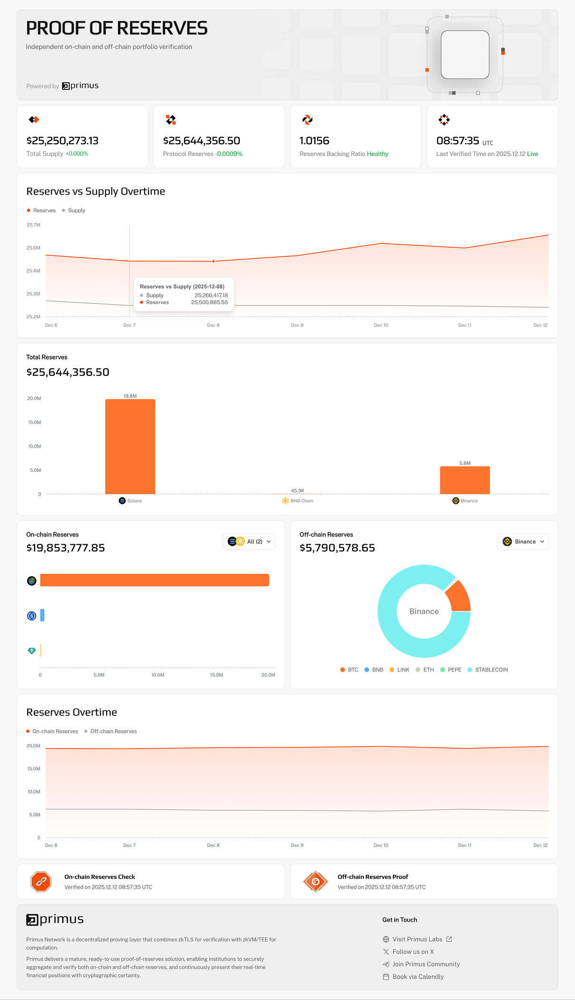

# Proof-of-Reserves Product Introduction

## Overview

Primus enables verifiable transparency over institutional reserves through a **Data Verification and Computation** (DVC) architecture. By combining **zkTLS** for authenticated data retrieval with **zkVM/TEE** for verifiable computation, Primus delivers a mature, ready-to-use **Proof-of-Reserves** (PoR) solution.

Institutions can securely aggregate and verify on-chain and off-chain reserves, and continuously present their real-time financial positions with cryptographic certainty.

There is no need to self-configure anything upfront. Submit the Requirements Form (see Step 1) and our team will reach out promptly to scope your use case.

**Integration can be completed in under a week, with no upfront costs and no operational overhead beyond the subscription fee.**

## Why Proof-of-Reserves Matters

| **Challenge** | **Primus Solution** |
| ------------------------------------------------------------ | ------------------------------------------------------------ |
| Lack of trust in off-chain assets or custodian balances | zkTLS attests the authenticity and provenance of off-chain data while institutions retain full control of all private credentials. |
| Infrequent or manual reserve disclosure | Automated, high-frequency PoR refreshing with customizable verification intervals. |
| Privacy concerns when disclosing account-level balances | zkVM enables privacy-preserving aggregation with selective disclosure. |
| Fragmented on-chain and off-chain reserve data | Primus aggregates all sources into one consolidated, verifiable reserve total. |

## Product Highlights

**1. Fully Managed Setup**

Primus handles the full PoR setup on your behalf.

After understanding your requirements, our team will:

- Design the verification scope for your on-chain and/or off-chain reserves
- Configure disclosure preferences and what becomes publicly visible
- Deploy a **local PoR service** that runs in your environment
- Publish a dedicated **public dashboard** under `por.primuslabs.xyz/...` for users, auditors, and partners

  

**2. One Integration, Zero Maintenance**

Primus abstracts away all external integrations and ongoing operational work.

A single integration grants access to all supported on-chain networks, off-chain data sources, and the full verification pipeline, including zkTLS attestation, TEE, zkVM proving, node infrastructure, and API integrations.

## Workflow

**Step 1. Share your requirements**

Complete the [Requirements Form](https://docs.google.com/forms/d/e/1FAIpQLSc9ijOzKQla4oOpSytvf4K3hjrfxAT-dGM0VUIFXAR94qn5Qw/viewform). **No matter how early your idea is, feel free to submit.** Our team will review your request and contact you promptly.

**Step 2. Primus designs and configures your PoR**

Based on your needs, we will:

- Define your organization's identity and public showcase path under `por.primuslabs.xyz/...`
- Set up on-chain reserve sources (including wallet ownership verification where needed)
- Build a customized off-chain PoR program when required
- Configure disclosure scope, optional supply details for the reserve-backing ratio, and alert thresholds

You may also refer to the [PoR Demo](https://github.com/primus-labs/por-demo/tree/main) for examples of how a customized PoR program is structured and how it operates.

**Step 3. Receive your local service and public dashboard**

Once configuration is complete, Primus delivers:

- A **local PoR service** deployed in your environment to run verification on your schedule
- A **public dashboard** that presents your verified reserves in real time

**Step 4. Go live**

Share your public dashboard URL with users, auditors, and partners. Primus continues to operate and maintain the verification pipeline on your behalf.

## Pricing

Primus PoR follows a simple, transparent pricing model.

We provide a **7-day free publishing period**, allowing you to launch a PoR project at no cost. After the trial ends, continued public hosting requires a **monthly subscription**.

Contact our team for pricing and subscription details.

## Technical Overview

Primus combines zkTLS, TEE, and zkVM in a decentralized proving network to enable authentic and privacy-preserving verification of on-chain and off-chain reserves.

**zkTLS for Authentic Off-Chain Data**

A custom PoR program runs in your own environment, using zkTLS to retrieve real-time balances from sources such as CEX accounts. zkTLS proves the data comes from the legitimate API endpoint over a trusted TLS session, without exposing API keys or raw account details.

**TEE for Secure Data Handling**

Retrieved data is processed inside a Trusted Execution Environment (TEE), ensuring confidentiality during computation and establishing a secure channel to the proving network.

**zkVM for Verifiable Aggregation**

Through the TEE, committed data is sent to a zkVM network for aggregation and final computation. A zero-knowledge proof guarantees that the disclosed reserve value is correctly derived from authentic balances, while all sensitive information remains private.

## Examples

Below are code samples covering the major components involved in a Proof-of-Reserves integration:

1. Framework Intro: [https://github.com/primus-labs/DVC-Intro](https://github.com/primus-labs/DVC-Intro)

2. Client (deployed in your environment): [https://github.com/primus-labs/por-client-demo/tree/main/client](https://github.com/primus-labs/por-client-demo/tree/main/client)

3. zkVM Program: [https://github.com/primus-labs/por-demo/tree/main/zkvm-program](https://github.com/primus-labs/por-demo/tree/main/zkvm-program)
